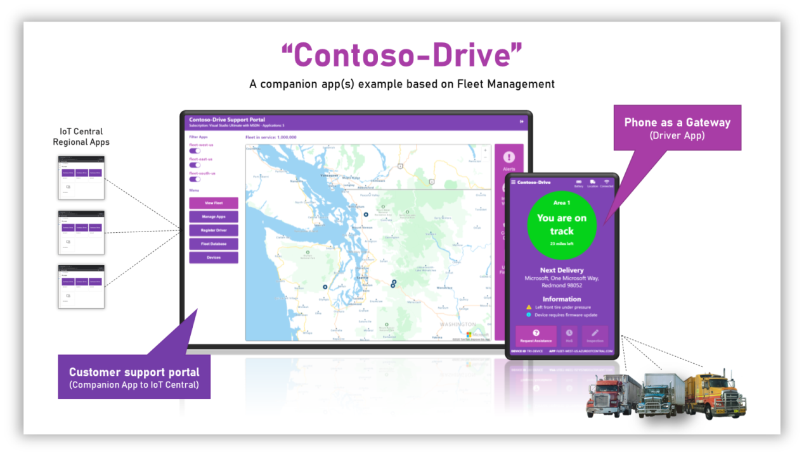
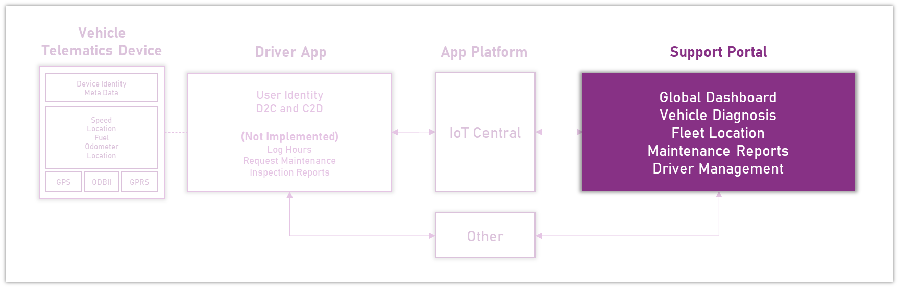
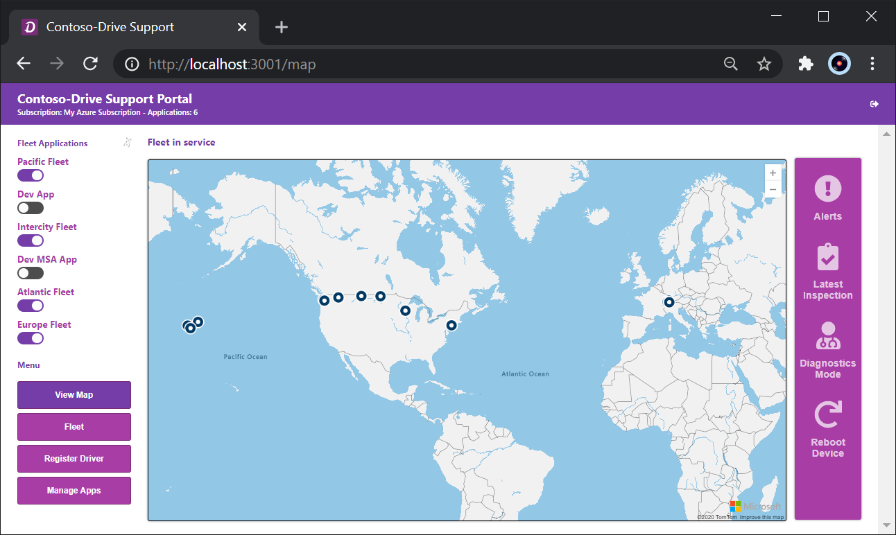
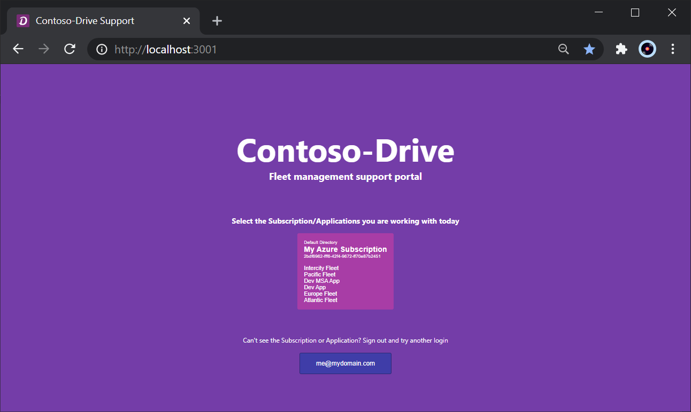
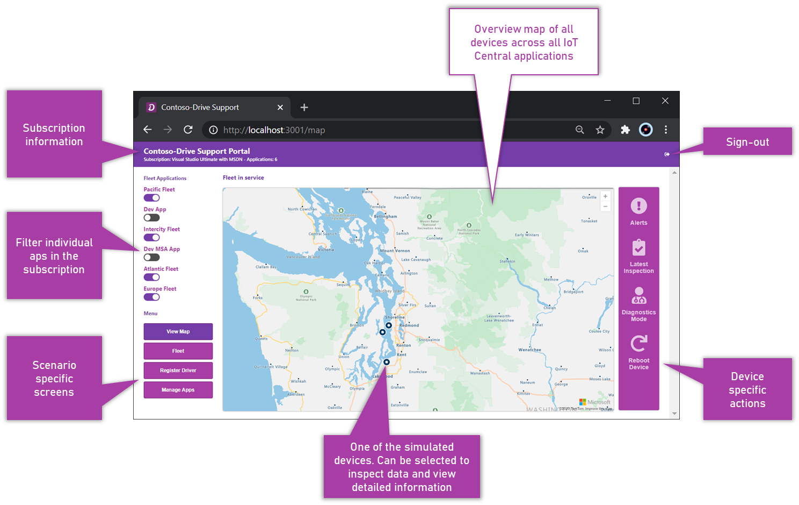
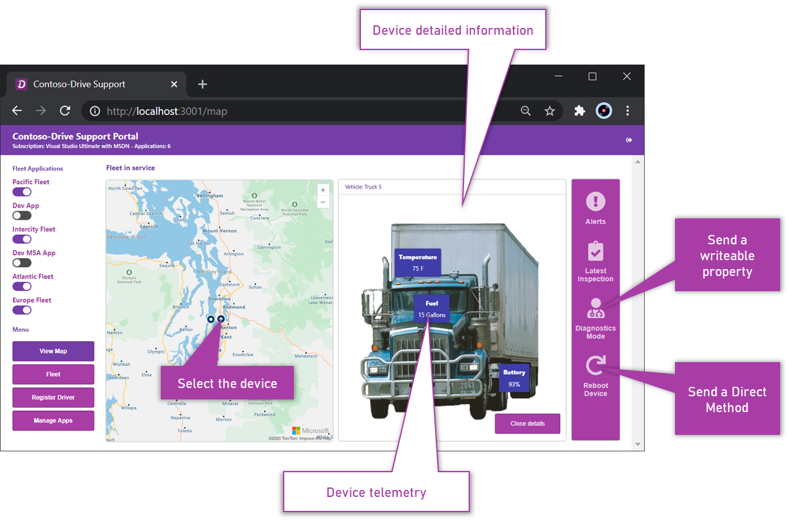
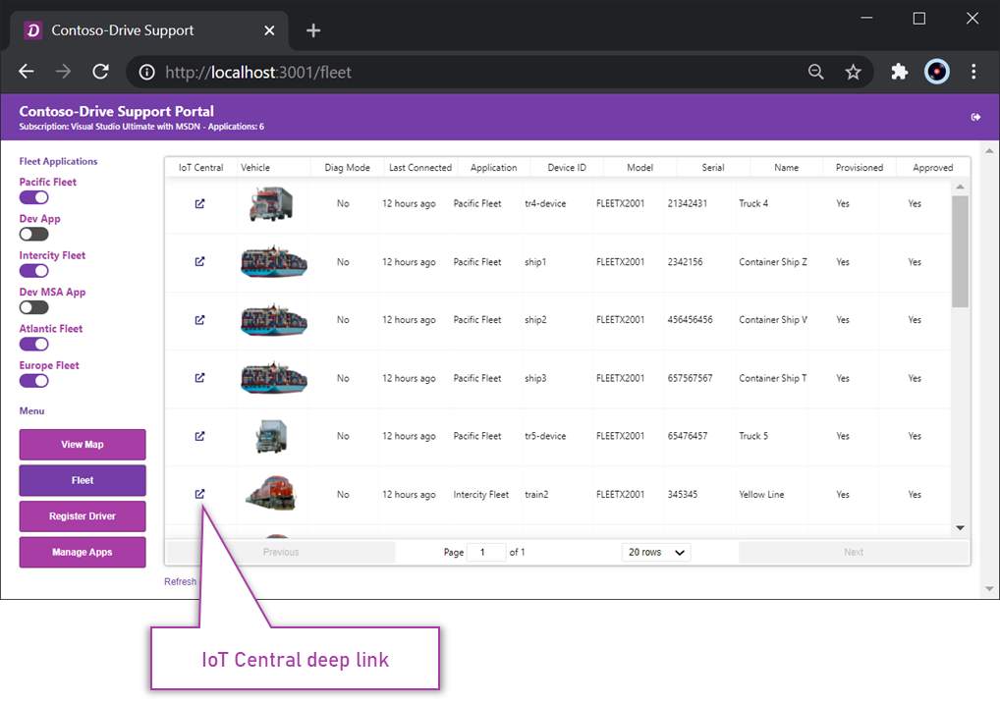
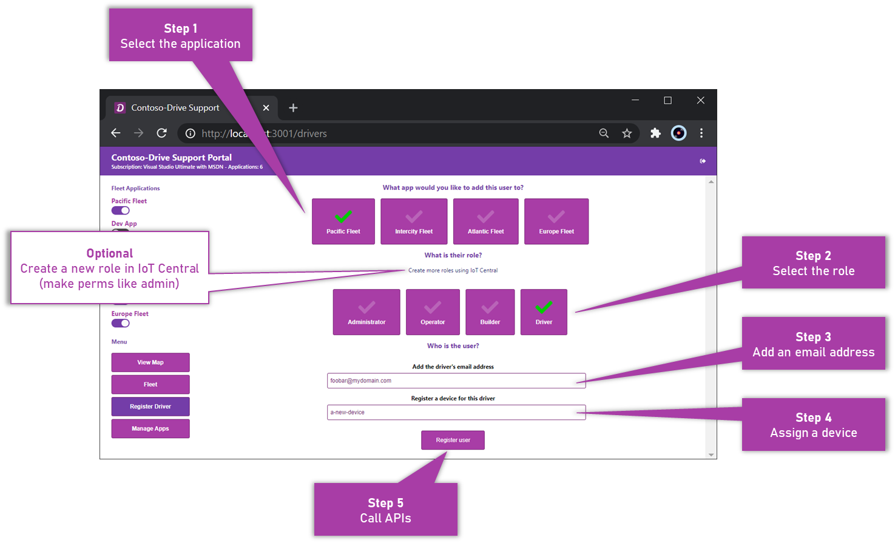
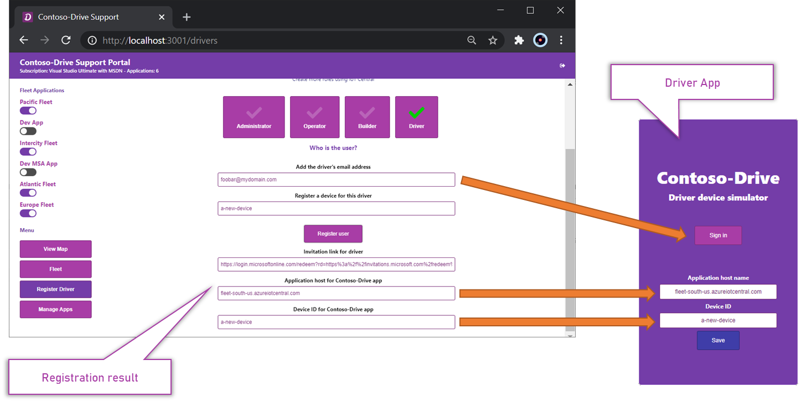
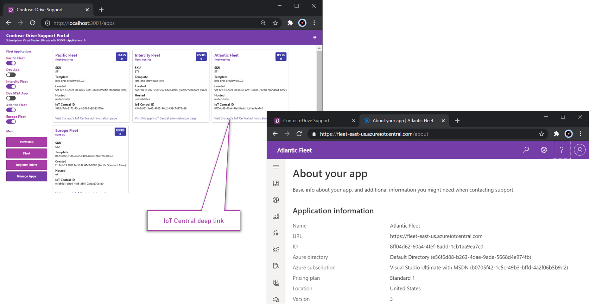

# Contoso-Drive Support Application
This repo is an IoT Central companion experience which is part of a set of repos demonstrating a Fleet Management scenario. To get up and running with the full experience, visit the Learning Path [here](https://github.com/iot-for-all/contoso-drive-learning).

## Companion experience overview

Contoso-Drive is an example codebase and demonstration of an IoT Central companion experience. It's a codebase built around Fleet Management scenarios and leverages the Azure IoT Central REST APIs to communicate with the corresponding IoT Central applications.

<p align="center"></p>

[Watch a video of the Contoso-Drive experience here](https://youtu.be/dO_sEZEgpFM)

The Contoso-Drive companion experience is split into three concepts

* __The Support Portal.__ This application is an example of role specific scenarios for the technician/support person of Contoso-Drive. Typically this is a desktop application and is owned, managed and deployed by the Contoso-Drive company.

* __The Driver App.__ This application represents the device that sends the vehicle's telematics to IoT Central which is subsequently available in the Support Portal. Typically this is a phone acting as a gateway and is run on the driver's mobile phone or an internet accessible device. Visit [this](https://github.com/iot-for-all/contoso-drive-simulator) repo to see the Driver Application.

* __The IoT Central application(s).__ The main experience to manage the Contoso-Drive devices and admin level tasks for Contoso-Drive. It is typically used by the technician/support person and other privileged persons to perform admin level device management, insights and actions. Visit [this](https://github.com/iot-for-all/contoso-drive-learning) repo to see the Learning Path on how to set up the Contoso-Drive IoT Central applications.

__This repo represents the Support Portal application scenario.__ 

<p align="center"></p>

# The Support Portal codebase
The codebase is a SPA application that runs 100% in the browser. There is no server side API component. The server is only used to deliver the SPA files to the browser. All device interactions have been fully coded into the application. Therefore simulating or even using a real device will make the application functionally work as expected.

<p align="center"></p>

# Usage

## Setup

There are a couple of steps that need to be completed before running the code.

* __Configure the AAD application__

  You will need to have an AAD application so that an authenticated user can be authorized to use IoT Central APIs and ARM. If you have setup the support portal already, you can share the same AAD application. If you need to setup a new or different AAD application, use the following repo to guide you [Setting up an AAD application to work with IoT Central](https://github.com/iot-for-all/iotc-aad-setup) Once you have an AAD application, change the [config.ts](/src/config.ts) file and update the following.

  ``` 
  AADClientID: '<YOUR AAD APPLICATION CLIENT ID HERE>',
  AADDirectoryID: '<YOUR ADD APPLICATION DIRECTORY ID HERE>',
  ```

* __Configure Azure Maps__

  You will need to add an [Azure Maps Account](https://portal.azure.com/#create/Microsoft.Maps) into your Azure Subscription (choose __Standard S0__ pricing tier). Once completed get your Primary Key from the Authentication option in Azure Portal for Azure Maps Account page and change the [config.ts](/src/config.ts) file and update the following.

  ```
  AzureMapKey: '<YOUR AZURE MAPS PRIMARY KEY HERE>'
  ```

## First run

On first run you will need to sign in and select the subscription the IoT Central Contoso-Drive applications have been added to. All apps in that subscription will be available but only those with the correct IoT Central device template will be used to query data. If you have followed the Learning Path module, you will be familiar with this concept.

<p align="center"></p>

### __Authentication__

Once you have provided valid credentials, you will not need to re-provide these until the authorization token expires. During that period, every use of the application will silently sign you in.

# Regular use

Once the app has been setup and is running, there are several screens that can be visited that demonstrate how to use the APIs to provide scenario specific experiences.

## View Map screen
The view map screen is a visualization that spans across applications within the subscription. 
 Here devices (vehicles) are selectable which opens a side panel. Filtering the apps will remove devices from the map so the information becomes discrete.

<p align="center"></p>

### __Vehicle details__
Here basic telemetry from the device can be viewed. Additionally, the device specific actions become available. The only operations that can be carried out are Diagnostics Mode (a writeable Twin property) and Reboot Device (a Direct Method). If you are using the Driver Application to provide simulation, you will see the results of these operations in that application as well as status in the details panel.

<p align="center"></p>

## Fleet screen
There are no real interactions on this screen other than application filtering. This screen examples how to use the IoT Central APIs to combine device property, cloud and instance data into a single view. Additionally, it demonstrate single/silent sign on deep-linking over to IoT Central to see it's version of the device's details screen.

<p align="center"></p>

## Register Driver screen
This screen is designed to demonstrate a series of API calls to create and register users into the application. This is the API orchestration.

 - Use ARM APIs to validate access to the Azure Subscription
 - Call MS Graph APIs to create a new user in the AAD directory
 - Call IoT Central APIs to create the same user in IoT Central
 - Call IoT Central APIs to create a new device and update a cloud property (the user's email) or update an existing device's cloud property
 - Provide registration information for the Driver Application

__Before running the Driver Application, the user should be registered using this flow__

### Using the register driver experience
Follow the steps in order to register a new user. Though the  user's email address is additionally added as a Cloud Property, it offers no functionality gain and merely serves to demonstrate calling the API.

<p align="center"></p>

Once completed, the registration information can be used for the Driver Application. Use the orange arrows to follow how the data lines up between the two apps.

<p align="center"></p>

## Manage Apps screen
The manage apps screen provides basic information about each IoT Central application and is taken from the Azure Subscription data. The only interaction here is to deep-link over to the respective IoT Central application (which will also silently sign you in)

<p align="center"></p>

# Installing, building and running the codebase

The codebase is built on [create-react-app](https://createreactapp.github.io/) and therefore implements the same react-scripts. If you are not familiar with it visit the site for more details.

## Install

``` 
npm ci
```

## Build

``` 
npm run build
```
## Run

``` 
npm start
````

## Use

``` 
http://localhost:3001
````
